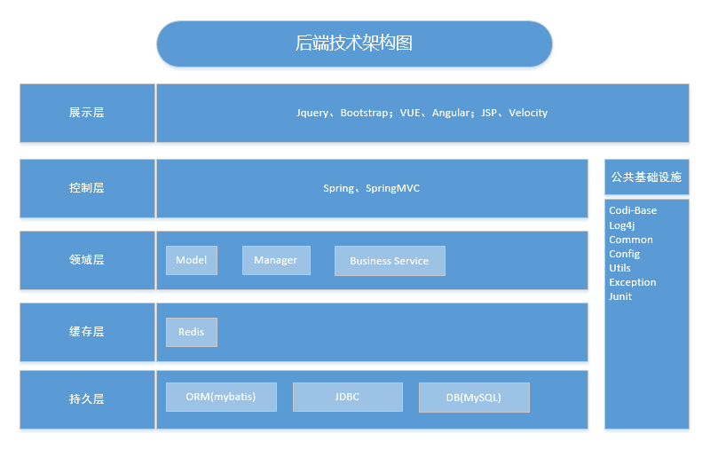

superman
-----------

## Architecture



- codi-base
- Servlet 3.0
- Tomcat 8.5.39
- Redis
- MySQL
- Spring
- SpringMVC
- Spring-Session

## Developer Usage

- pom.xml
````
<dependency>
    <groupId>com.codi</groupId>
    <artifactId>superman-base</artifactId>
    <version>x.x.x</version>
</dependency>
````
- 执行SQL`sql/superman-base.sql` `sql/superman-base-init.sql`
- 配置springmvc.xml 扫描controller
````
<context:component-scan base-package="com.codi.superman.*.controller" use-default-filters="false">
````
- spring-application.xml 扫描mybatis文件
````
    <bean id="sqlSessionFactory" class="org.mybatis.spring.SqlSessionFactoryBean">
        <property name="dataSource" ref="dataSource"/>
        <property name="typeAliasesPackage" value="${SPRING_MYBATIS_TYPE_ALIASES_PACKAGE}"/>
        <property name="mapperLocations" value="${SPRING_MYBATIS_MAPPER_LOCATIONS}"/>
````
